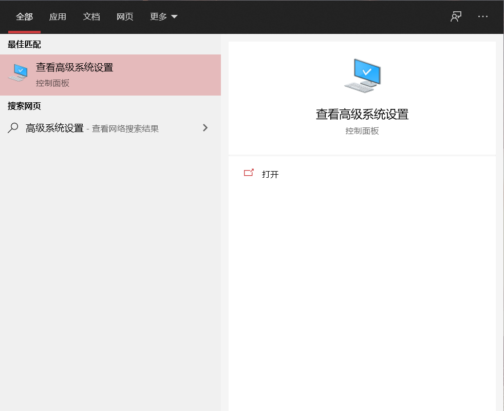
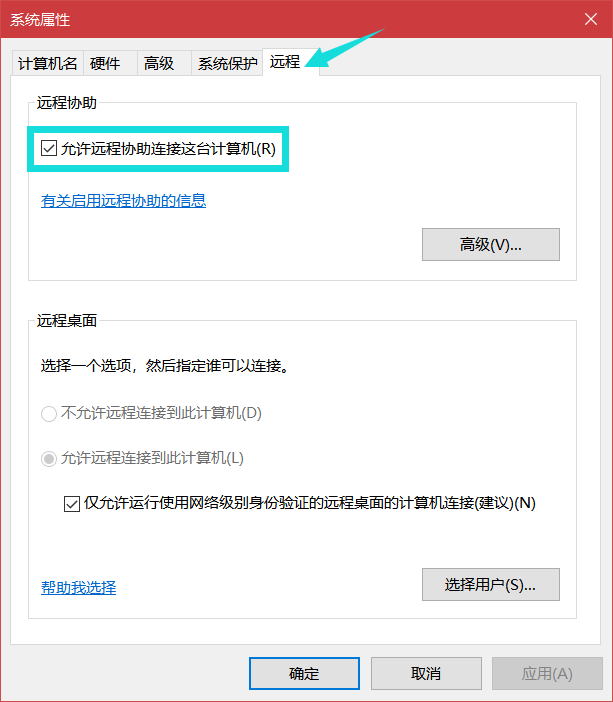
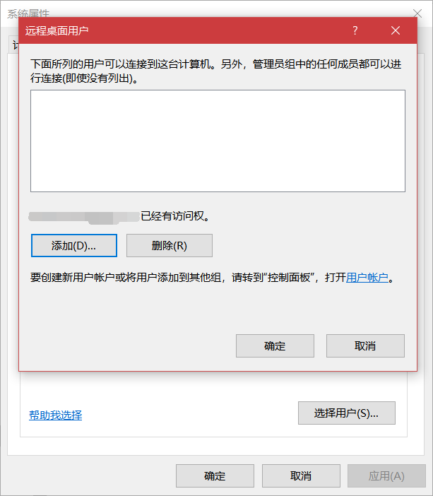
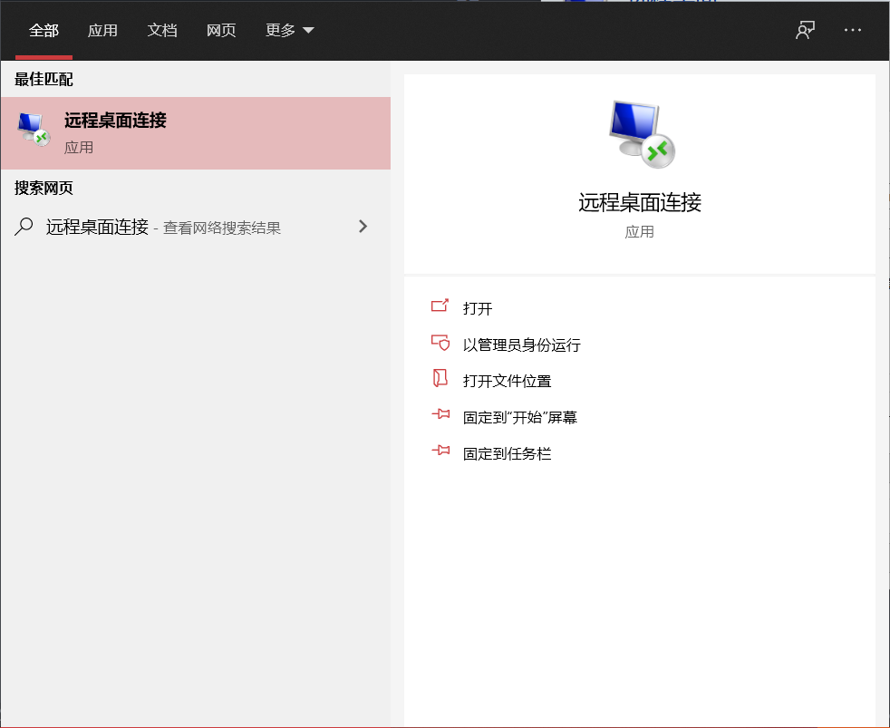
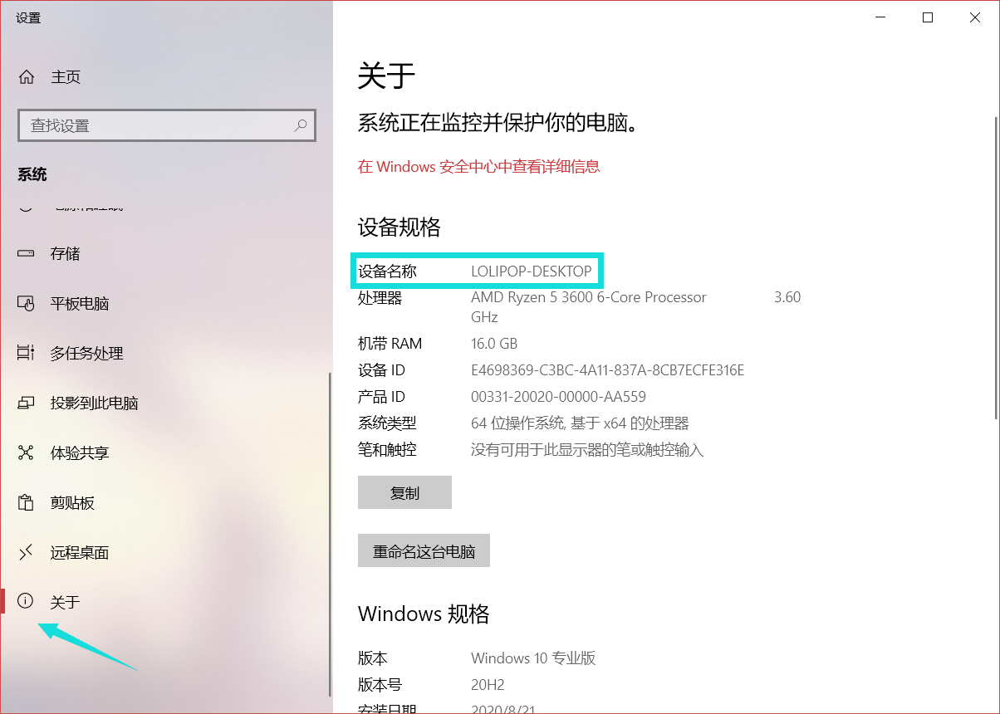
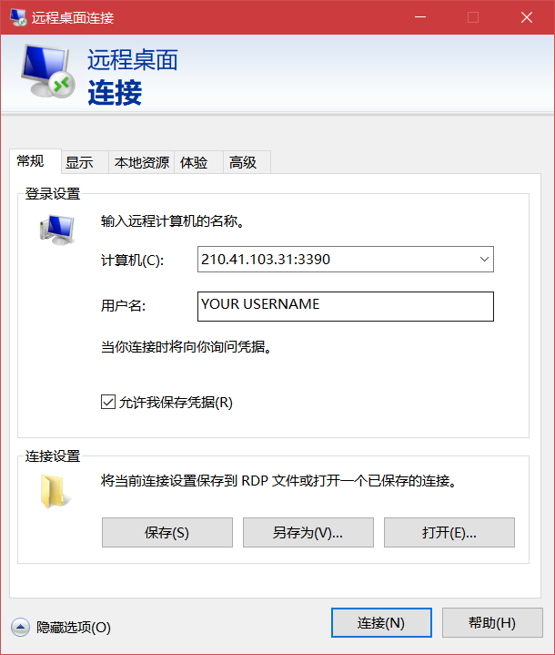

# 远程桌面连接指南

什么情况下我应该使用远程桌面？

远程桌面可以帮助我们更好地学习办公。如果您已经在笔记本电脑上配置好了与目的主机相同的配置，且同步了所有数据到笔记本电脑上来，使用远程桌面似乎没有那么必要。但是如果您想拥有更高的生产力，简化自己的生活，远程桌面将会成为自然而然的选择。引用 Vuex 文档中的话说就是：

> 引用 Redux 的作者 Dan Abramov 的话说就是：
>> Flux 架构就像眼镜：您自会知道什么时候需要它。

## 环境

目的主机：Windows 10 专业版（可以在网上花很少的钱买到激活码）

进行连接的主机：Windows 10 任意版本

- 当然，您也可以选择开源的系统配置远程桌面。
- 本文以电子科技大学（沙河校区）寝室里的校园网为例，大多数场合需要拨打网络运营商开公网 IP.

## 配置远程桌面

首先需要目的主机打开允许远程协助的选项。进入高级系统设置-远程，勾选即可。

您可以选择允许进行远程登录的账号，通常情况下您只需要连接自己的微软账号就可以了。

此时，如果您的两台主机都在一个局域网下（如寝室里的校园网），则可以通过目的主机的计算机名称进行远程桌面控制了。

您可以在设置-关于中找到您的设备名称。当然，也可以通过设备的内网 IP 地址连接。

但是，我们的目的是为了能在任何连接有互联网的位置都可以访问到目的主机，该怎么做呢？

首先，我们要拿到目的主机所连接路由器的公网 IP 地址，在地址栏键入 `192.168.1.1` 进入路由器管理页面查询。您也可以通过百度搜索 `ip` 获取公网 IP 地址。

以 TP-LINK 为例，如下图 `IP 地址` 处即为公网 IP 地址 `210.41.103.31`。

一般家庭用户默认没有开放公网 IP 地址，您可以致电网络运营商，申请开放公网 IP 地址，几分钟就可以搞定。

利用路由器的虚拟服务器功能，将内网的 IP 地址上的某端口通过端口映射提供给公网，使得公网能够访问到目的主机的远程桌面服务。

在此之前，需要获取目的主机的内网 IP 地址。同样可以通过命令行中的 `ipconfig` 命令获取。

以 TP-LINK 为例，如下图 `IP` 处的 `192.168.1.105` 即为目的主机的内网 IP 地址。

一般来说，路由器会按照互联网连接的顺序分配内网 IP 地址，因此端口映射时可能将错误的主机设备映射到公网。因此我们可以利用路由器的 `IP 与 MAC 绑定` 功能，将目的主机 MAC 地址和任意内网 IP 地址绑定，确保该 IP 地址对应目的主机。

以 TP-LINK 为例，如下图将内网的 `IP` 地址 `192.168.1.105` 与 `MAC` 地址为 `F6-A2-6C-58-B5-A4` 的主机绑定。

最后一步，通过路由器的虚拟服务器功能，将目的主机的 3389 端口映射为公网端口。3389 端口为默认的远程桌面服务端口，假如您有更改过端口号，请修改为对应的映射端口。**注意，由于电子科技大学信息中心的安全考虑，默认关掉了校园网的 3389 外部端口，您需要任意设置一个其它外部端口，如 3390。**

以 TP-LINK 为例，如下图将内网的 `IP` 地址 `192.168.1.105` 的 `内部端口` 3389 与 `外部端口` 3390 绑定。

现在您可以通过任意连接互联网的主机通过远程桌面服务访问目的主机！

在重启路由器时，分配到的公网 IP 可能发生改变，此时需要通过新的公网 IP 连接到目的主机。电子科技大学采用哈希表的方式分配寝室网的公网 IP，因此一般情况下不会发生改变。
